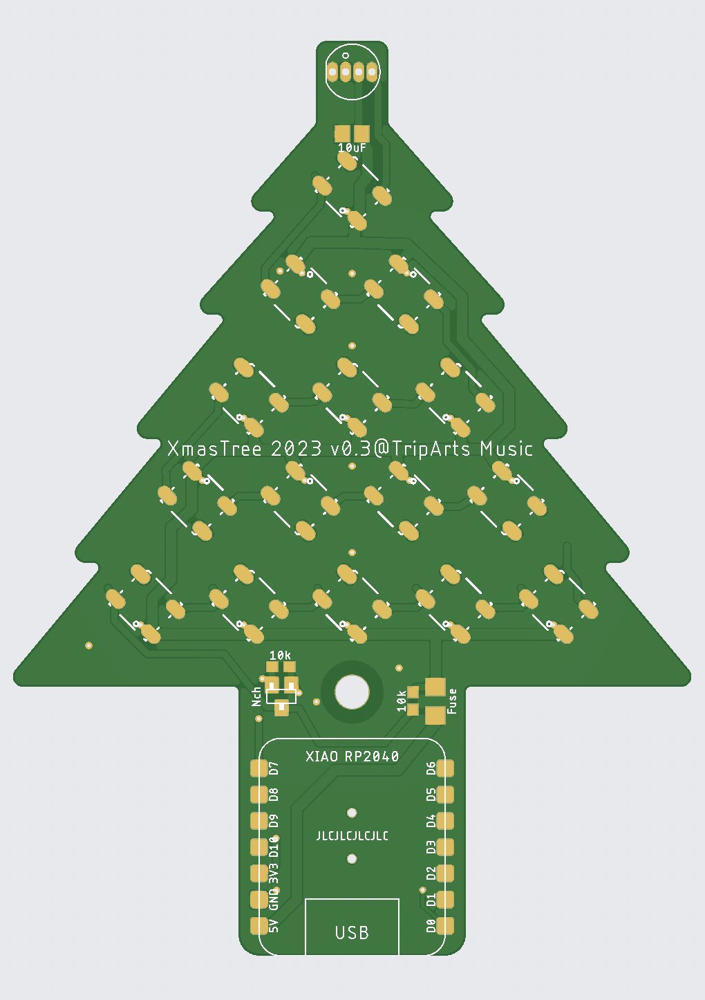

# xmas-tree2023

Xmas Tree基板



## 基板作成方法

[JLCPCB用 gerberデータ](https://github.com/tadfmac/xmas-tree2023/tree/main/gerber/forJLCPCB/v0.2) を https://jlcpcb.com へ 2Layer で頼めば届きます。

## 部品一覧

|パーツ|数量|
|:---|---:|
|[Seeed XIAO RP2040](https://www.seeedstudio.com/XIAO-RP2040-v1-0-p-5026.html)|1|
|WS2812B (v5でない旧ver.)|15|
|[PL9823-F5](https://akizukidenshi.com/catalog/g/gI-08411/)|1|
|500mA ポリスイッチ (1206)|1|
|抵抗 10kΩ (0603)|3|
|コンデンサ 10uF (0805)|16|
|スライドスイッチ (MSS22D18-SMD)|1|
|M3ナベネジ 20mm|1|
|M3ナット|1|

上記に加えて USB-Cケーブル（推奨：USB-C側がL字のもの）が必要です。（PC側のコネクタ形状はPCの仕様による）

## ファームウエア

- [test (LED blinkのみ)](./arduino/test/test.ino)
- [usb-midi (WIP)](./arduino/usb-midi/usb-midi.ino)

## usb-midi ver.のテスト

```
cd xmas-tree2023
npm i
node ./app.mjs
```
これで webサーバが立ち上がるので、ブラウザから下記URLにアクセス

```
http://localhost:2000/
```
画面には何も表示されませんが、xmas-tree2023を接続するとLEDが点滅します。

## スタンド (3Dデータ)


[ファイル](./3dprint/stand/TreeStand1.stl)

## Licenses

MIT


